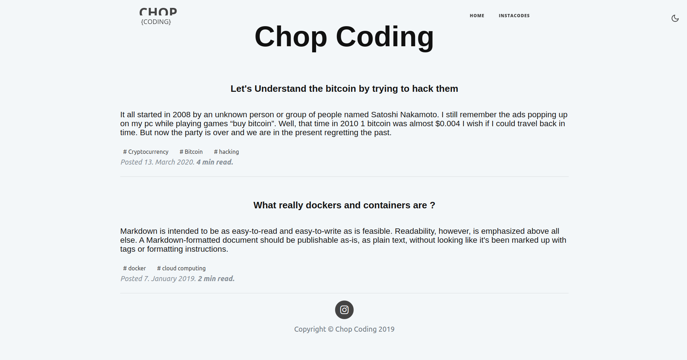
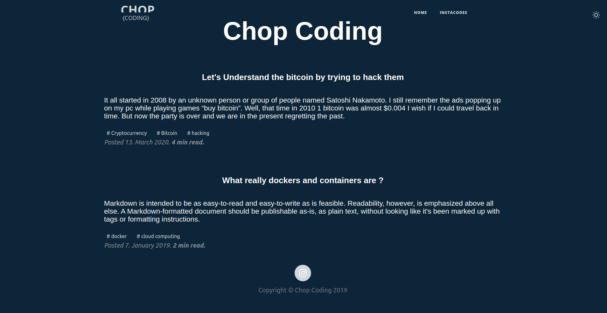
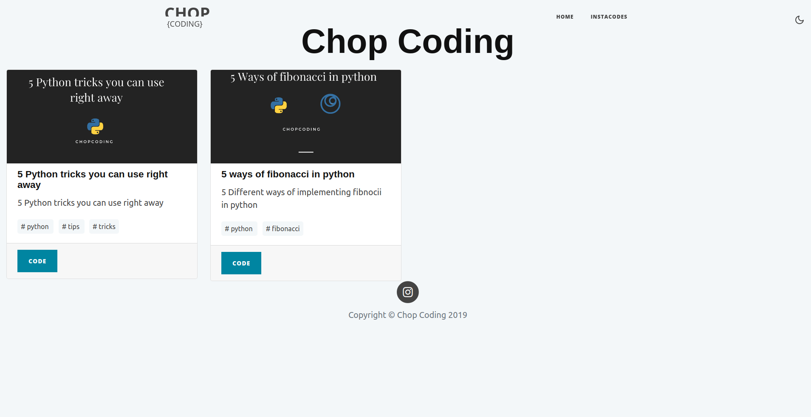

# Gridsome Blog Starter Template

>I created this blog template using bootstrap and power of gridsome i mainly want to use this blog template as placeholder site for one of my instagram account.

## Features
- Beautiful and simple design.
- Markdown for content.
- Tags support.
- Setup multiple pages with different content(Instacode)
- Bootstrap support
- Fontawesome support
- Dark and light mode
  

>Instacode- Inscode is separate place where i add all the codes related to my instagram profile

##### Clone this repo
```python
run npm install
setup gridsome
gridsome develop
```
## Screenshots



