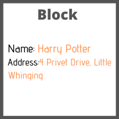
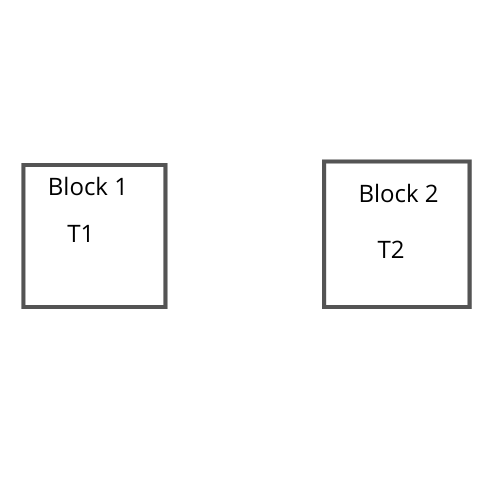
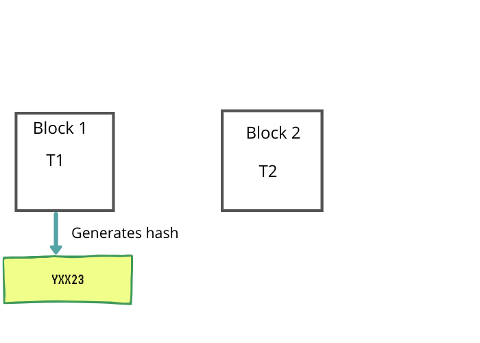
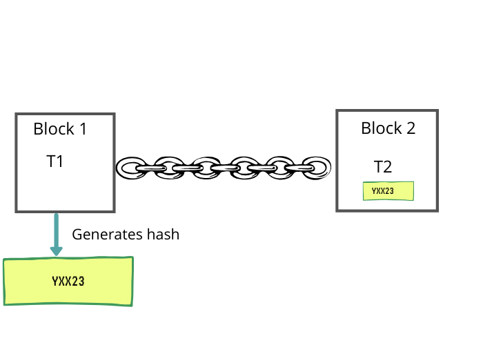
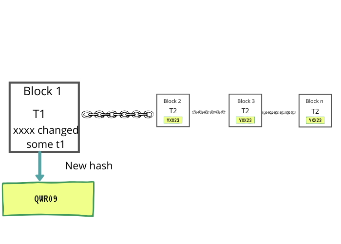
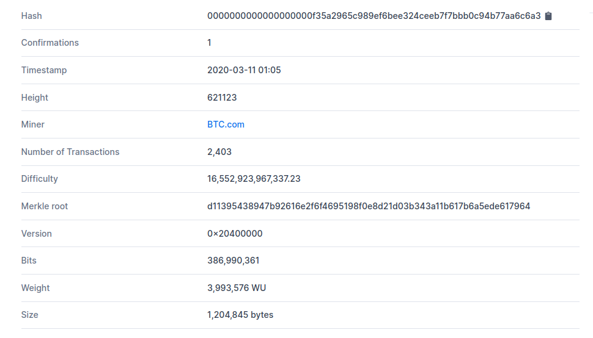
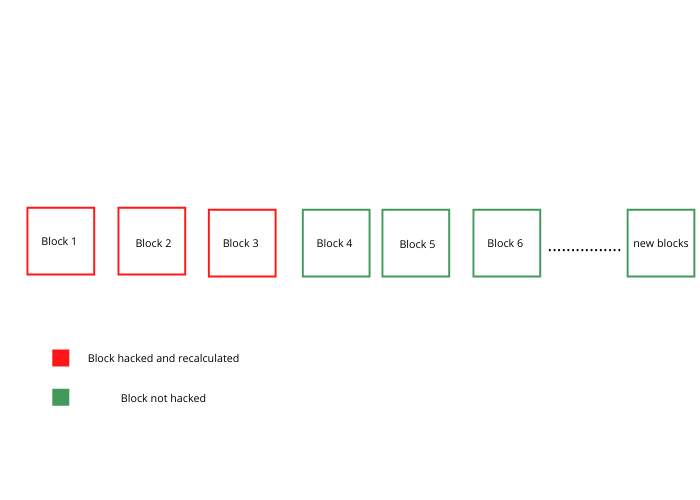

It all started in 2008 by an unknown person or group of people named Satoshi Nakamoto. I still remember the ads popping up on my pc while playing games “buy bitcoin”. Well, that time in 2010 1 bitcoin was almost $0.004 I wish if I could travel back in time. But now the party is over and we are in the present regretting the past.
Bitcoin is created, distributed, traded and stored with the use of a decentralized ledger system known as a blockchain. To hack the bitcoin we need to hack the blockchain. Blockchain is a digital concept of storing the data in a much secured manner. Let's start by understanding a single block of data

Bitcoin is created, distributed, traded and stored with the use of a decentralized ledger system known as a blockchain. To hack the bitcoin we need to hack the blockchain. Blockchain is a digital concept of storing the data in a much secured manner. Let's start by understanding a single block of data

#### Single Block Of data

Visualize a block of some data consisting of name and address

<!--  -->
<!-- <g-image src="~/images/block.png" width="500" height="500" fit="contain"/> -->

These blocks are now chained to other blocks and their data can never be altered again. These chains are now publicly available to everyone. This technique allows us to keep records of anything. In the case of bitcoins its the transaction data which is stored inside the block. Information cannot be altered once it's inside the blockchain.

#### BlockChain
When these blocks of information are chained together they are known as the blockchain. Let compare these 2 blocks Block 1 and Block 2 both the blocks have some transactional data which is T1 and T2 respectively.

To chain one block to another block we need to generate a hash or a unique digital signature that corresponds to the data inside the block in our case its the transactional data. Each block stores the hash of the previous block if anything inside the block is changed even a single-digit the whole hash is updated. In computer science, we call this method as hashing.

Let's say block 1 generates a hash YXX23 by adding this hash to block 2 we are chaining them together. Once this hash is added to block 2 it will be the part of block 2 data. Now, if block 2 tries to generate its hash it will be generated by keeping the hash of block 1. Remember by changing even a single line of data inside block 1 it will completely change the generated hash. To chain the blockchain we need to add the hash of block 1 to block 2.

Generated hash is not always the qualified hash. A block is only be accepted if its hash starts with a certain pattern. For example 6 consecutive Zeroes 000000xff23jgkaj3hiflerihldsak93ildjlgas (this is how a real hash looks like). Even a small change will update the hash string. A small piece of string is added to the block which is known as a nonce. To find the qualified hash, nonce or newly added string of data is changed repeatedly until the qualified hash is generated with the specific pattern, the process of calculating the qualified hash is known as mining(Mining is the whole new topic to discuss).

> A transaction is a transfer of value between Bitcoin wallets that gets
> included in the block chain. Bitcoin wallets keep a secret piece of data called a
> private key or seed, which is used to sign transactions, providing a
> mathematical proof that they have come from the owner of the wallet. The 
> signature also prevents the transaction from being altered by anybody once it 
> has been issued. All transactions are broadcast to the network and usually 
> begin to be confirmed within 10–20 minutes, through a process called mining.

#### Let's hack the blockchain
We have understood the raw idea behind the blockchain, now let's start hacking the blockchain by manipulating the transaction at block 1. If we changed the transaction detail in block 1, a new hash is generated. Hash generated by block 2 was based on the previous hash generated by block 1. Since the new hash is generated for block 1 the chain between block 1 and block 2 will be broken.

Since the hash of block one is updated block 2 hash will change since block 2 hash was based on block 1 hash. If block 2 hash is changed block 3 hash will suffer and the chain will be broken between block 2 and block 3. A small change in block 1 will act as a chain reaction and complete blockchain will be destroyed.
Now in order to make our hack successful, we need to calculate the hash pattern from block 1 and keep on calculating the new hash of every block till the end of the chain(It's not that easy as new blocks are kept on adding)

This is how a blockchain details look like

The above block was recently added with the depth of #621123. (At the time of writing this post)
Note the hash value, finding the hash like this is not at all easy it requires a crazy amount of computational power to calculate, imagine the computational power required to change and update the blocks till #621123 and still counting. Giving all this block a new number or digital signature or hash will be very costly.

The rest of the network keeps on calculating the new hash for every subsequent block since millions of users are mining the bitcoin. So even if a corrupt miner tries updating the block 1 he will have to recalculate all the blocks as well as all the new blocks which are being added at the end of the chain for that he needs to have more computational power than the rest of the world, which is practically impossible to have. Unless everyone stops mining the bitcoins.

> Such types of attacks are known as the 51 % attack as you would need more
> than 50% of computational power to execute the hack